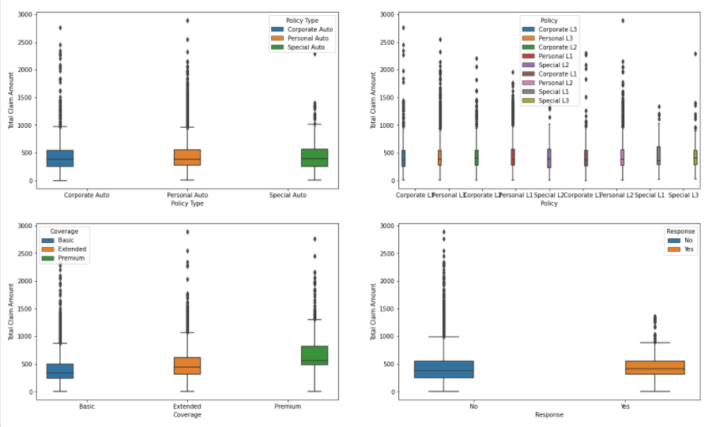

# Overview

In this project, I will try to estimate the Customer LifeTime Value by using RFM segmentation work and Machine Learning algorithms on Watson's customer data, which I received on Kaggle. I will use the variable "Customer Lifetime Value" as the target variable. The dataset I have used consists of 9134 lines and 24 features.

## Introduction

- When the chart I shared below is examined, the total claim, premium and inception values generated by the tools according to the education levels of the customers can be seen.


- When the Policy Type, Policy, Coverage, Response variables and the Total Claim Amount variable are examined using boxplot, both the existence of outlier values and the distribution of claims for customers can be seen. For outlier values, data cleaning steps will be done with the using of Winsorizer in the future parts.



- When the pie chart below is examined, the percentage distribution of the income status of the customers among the states can be seen.


- When the average Income and average Customer Lifetime Value features are examined in between Jan and Feb, we can say that there is a significant relationship between Income and Customer Lifetime Value features.


After this step, I made RFM segmentation. I proceeded by using the "Effective to Date" variable for the Recency values, the "Policy Type" variable for the Frequency variable, and the "Total Claim Amount" variable for the Monetary variable. Then I scored this RFM data using quantiles. I divided the customers into 4 classes according to the scores formed as a result of this scoring. Details of the study can be found in "clvprediction.py" file and "clvpred.ipynb" file.


After RFM segmentation, capping with IQR was performed on customer data using Winsorizer. The final data was created with the most successful variables for RFR using Boruta method on the data. By looking at the correlations on this data, the variables that are correlated among themselves are removed from the final data in order to prevent the multicolineraty problem.


By creating train and test data on the final data, Linear Regression, Robust Regression, Ridge Regression, Lasso Regression, ElasticNet Regression, Stochastic Gradient Descent, Artificial Neural Regression, Random Forest Regressor and XGboost Regressor models were run, respectively.

- Below you can see Feature Importance chart created for ElasticNet Regression as an example.


- Below you can examine the loss and validation loss line chart created for the Artificial Neurol Network model.


- You can examine the MAE, MSE, RMSE, R2 Square and Cross Validation results produced by these models in the table below.


- The bar chart of the R2 Square results produced by these models is given below.


## Power BI Dashboard

- While the Data Charts sheet can be used for the analysis of the used dataset, you can examine the importance levels of the variables used and the metric details of the models created from the Model Results page, which includes the results of the models created.


You can download requirements via "pip install -r requirements"

```bash
pip3 install -r requirements.txt
```

Also you can visit my [Linkedin](https://www.linkedin.com/in/taylan-polat/) or [Github Page](https://github.com/taylan95?tab=repositories)